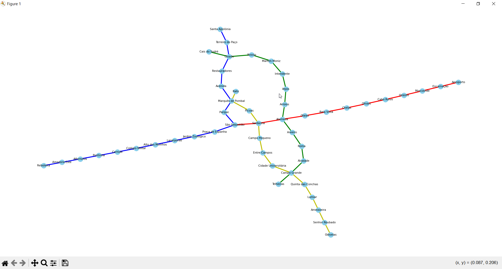

##Пояснення
###Карта метро Лісабону, Португалія

Візуалізація графа:

Він має 50 вузлів та 52 ребра. Ступені вершин - переважно 2, однак є пересадочні станції у яких ступені від 3 до 4.

Результати пошуку у глибину та у ширину.

Пошук у глибину виконується шляхом відвідування вершини, а потім рекурсивного відвідування всіх сусідніх вершин, які ще не були відвідані а у ширину - шляхом відвідування всіх вершин на певному рівні перед тим, як перейти до наступного рівня. У нас граф доволі комплексний, але навіть тут можна простежити послідовність: пошук у глибину рухається від станції Bels Vista аж до кінця гілки а потім вже назад досліджуючи інші шляхи. У глибину ж прослідкувати трохи важче, бо граф має комплексну будову.
###Адгоритм Дейкстри
Цей алгоритм шукає найкоротші шляхи між усіма вузлами. Вага ребра взята за 1, тому він фактично просто рахує відстані між вузлами.

